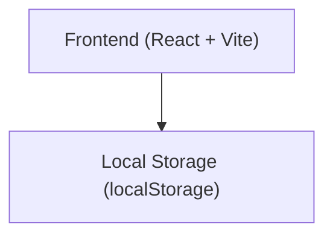
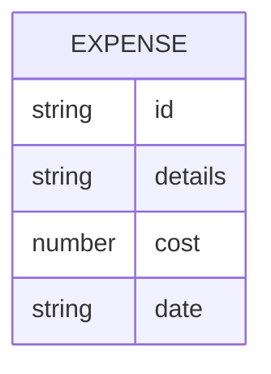

## 1. Architecture Design

## 2. Technology Description

* Frontend: React\@18 + TypeScript + Tailwind CSS\@3 + Vite

* Initialization Tool: create-vite

* Backend: None

* Database: LocalStorage for persistent data storage

## 3. Route Definitions

| Route | Purpose                               |
| ----- | ------------------------------------- |
| /     | Home page with expense list and total |

## 4. API Definitions

Not applicable - no backend.

## 5. Server Architecture Diagram

Not applicable - no backend.

## 6. Data Model

### 6.1 Data Model Definition

### 6
