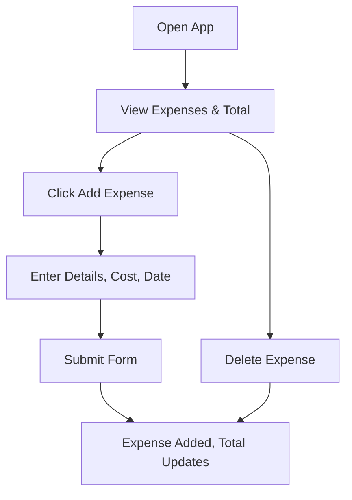

## 1. Product Overview
A simple, minimal spend management app designed like a notepad. The app allows users to track daily expenses with details, cost, and date, and calculates total expenses. Target users are individuals who want a straightforward way to monitor their spending.

## 2. Core Features

### 2.1 User Roles
Not applicable - single user app.

### 2.2 Feature Module
1. **Home page**: expense list, add expense button, total expenses display
2. **Add/Edit expense modal**: form for entering details, cost, and date

### 2.3 Page Details
| Page Name | Module Name | Feature description |
|-----------|-------------|---------------------|
| Home page | Expense List | Display all expenses with details, cost, and date |
| Home page | Total Display | Show total sum of all expenses |
| Home page | Add Expense | Open modal to add new expense |
| Home page | Delete Expense | Remove expenses from the list |

## 3. Core Process
1. User opens the app and sees list of expenses and total
2. User clicks "Add Expense" to open form
3. User enters expense details, cost, and date
4. User submits form, expense is added to list, total updates
5. User can delete expenses if needed

## 4. User Interface Design
### 4.1 Design Style
- Primary colors: Soft teal (#4fd1c5) and deep navy (#0f172a)
- Button style: Rounded, minimal, with subtle shadow
- Font: Inter for body, Poppins for headings
- Layout style: Clean, card-based, with generous white space
- Icon style: Simple, line-based icons

### 4.2 Page Design Overview
| Page Name | Module Name | UI Elements |
|-----------|-------------|-------------|
| Home page | Header | Title, total expenses prominently displayed |
| Home page | Expense List | Cards for each expense with details, cost, date |
| Home page | Add Button | Floating action button with "+" icon |

### 4.3 Responsiveness
Mobile-first design, fully responsive to all screen sizes, optimized for touch interactions.
